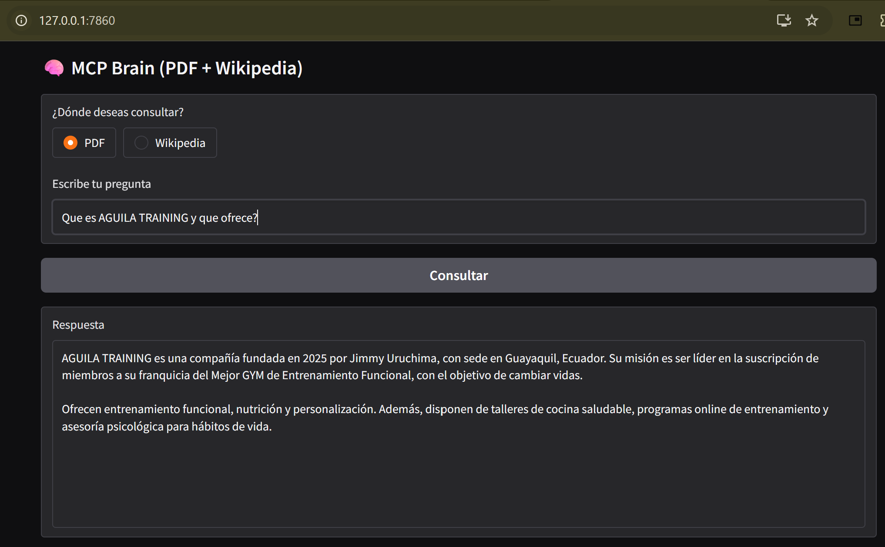

<<<<<<< HEAD
<<<<<<< HEAD
# MCP Brain 🧠

Asistente híbrido inteligente con:
- **RAG local** sobre documento privado (AGUILA TRAINING)
- **Herramienta remota vía MCP** (Wikipedia en español)
- Respuestas naturales con Gemini-2.5-flash

¡Demo interactiva con Gradio!

## Demo



## Arquitectura

```mermaid
graph TD
    A[Usuario] --> B["Interfaz Gradio<br><small>app_gradio.py</small>"]
    B --> C["Agente Orquestador<br><small>agent_graph.py</small>"]
    
    subgraph Fuentes
        C -->|Fuente = PDF| D["RAG Local<br><small>agente_tools.py</small>"]
        D --> E["Chroma Vector DB<br><small>Cache global</small>"]
        E --> F["Embeddings Gemini<br><small>text-embedding-004</small>"]
        F --> G["Gemini-2.5-flash<br><small>Respuesta natural</small>"]
        G --> H[Respuesta al usuario]
        
        C -->|Fuente = Wikipedia| I["Cliente fastmcp<br><small>Client('http://127.0.0.1:8000/mcp')</small>"]
        I --> J["Servidor MCP Remoto<br><small>mcp_server.py - puerto 8000</small>"]
        J --> K["Herramienta wikipedia_mcp<br><small>Búsqueda Wikipedia ES</small>"]
        K --> L[Contenido crudo]
        L --> M["Gemini-2.5-flash<br><small>Resumen conciso</small>"]
        M --> H
    end

    %% Estilos corregidos para asegurar contraste y legibilidad
    style A fill:#f0f8ff,stroke:#333,color:#000
    style B fill:#fffacd,stroke:#333,color:#000
    style C fill:#e6f3ff,stroke:#333,color:#000
    style D fill:#f0fff0,stroke:#333,color:#000
    style E fill:#f5f5dc,stroke:#333,color:#000
    style F fill:#f0fff0,stroke:#333,color:#000
    style G fill:#e0ffff,stroke:#333,color:#000
    style H fill:#fff0f5,stroke:#333,color:#000
    style I fill:#f0e6ff,stroke:#333,color:#000
    style J fill:#ffe6e6,stroke:#333,color:#000
    style K fill:#f0e6ff,stroke:#333,color:#000
    style L fill:#fff5ee,stroke:#333,color:#000
    style M fill:#e0ffff,stroke:#333,color:#000
    style Fuentes fill:#f8f8f8,stroke:#aaa,stroke-dasharray: 5 5,color:#000


    ## Flujo

```mermaid
sequenceDiagram
    autonumber
    participant U as Usuario
    participant G as Gradio<br/><small>app_gradio.py</small>
    participant A as Orquestador<br/><small>agent_graph.py</small>
    participant T as Herramientas<br/><small>agente_tools.py</small>
    participant C as Chroma DB<br/><small>Vector Store Local</small>
    participant Gem as Gemini-2.5-flash<br/><small>LLM + Embeddings</small>
    participant Client as Cliente MCP<br/><small>fastmcp Client</small>
    participant S as Servidor MCP<br/><small>mcp_server.py</small>
    participant Wiki as Wikipedia API

    rect rgb(240, 248, 255)
    Note over U, G: Inicio de la consulta
    U->>G: Escribe pregunta + elige fuente
    G->>A: Llama ejecutar_agente()
    end

    alt Fuente = PDF (RAG Local)
        rect rgb(230, 255, 230)
        Note over A, Gem: Flujo de Procesamiento PDF
        A->>T: buscar_en_pdf(pregunta)
        T->>T: preparar_pdf_rag()
        T->>Gem: Genera embeddings
        T->>C: Consulta Chroma DB
        C-->>T: Chunks relevantes
        T->>Gem: Genera respuesta
        Gem-->>T: Texto final
        T-->>A: Respuesta PDF
        end
    else Fuente = Wikipedia (MCP Remoto)
        rect rgb(255, 245, 230)
        Note over A, Wiki: Flujo de Procesamiento Wikipedia
        A->>Client: Conecta a FastMCP
        Client->>S: wikipedia_mcp(tema)
        S->>Wiki: Búsqueda API
        Wiki-->>S: Contenido crudo
        S-->>Client: Devuelve contenido
        Client-->>A: Contenido recibido
        A->>T: resumir_wikipedia()
        T->>Gem: Resumen natural
        Gem-->>T: Texto final
        T-->>A: Respuesta Wikipedia
        end
    end

    rect rgb(245, 245, 245)
    A-->>G: Respuesta final procesada
    G-->>U: Muestra en interfaz Gradio
    end
=======
# ai_projects
Aplicaciones Modernas para IA
>>>>>>> 48f75e93a38fbd7111b75637987678b3f287ae4d
=======
# ai_projects
Aplicaciones Modernas para IA
>>>>>>> 48f75e93a38fbd7111b75637987678b3f287ae4d
